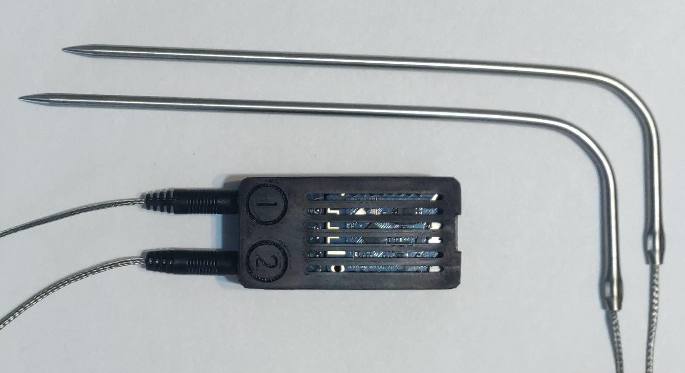
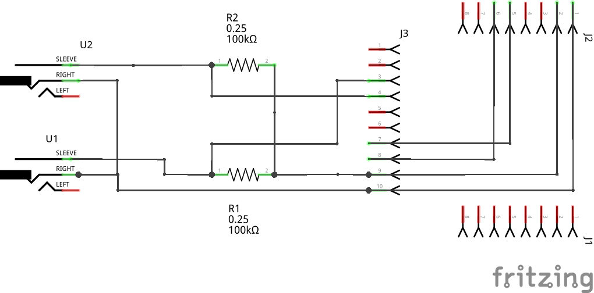
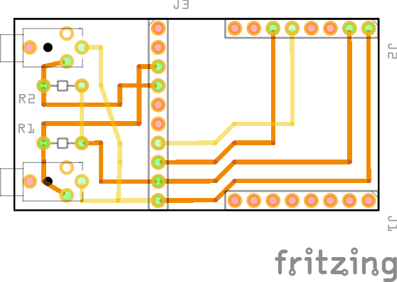
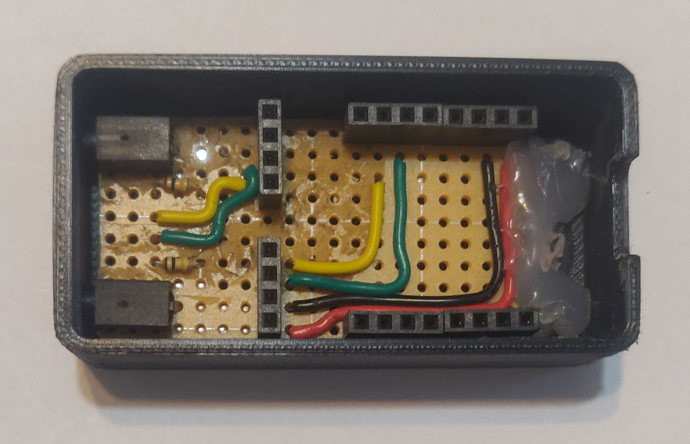
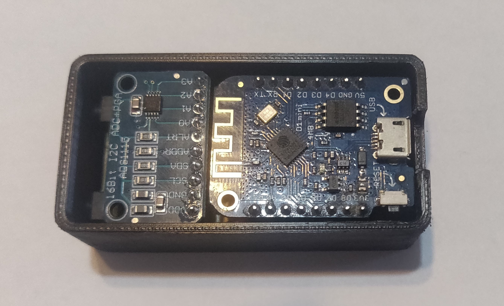

# wifi-bbq-thermometer

An ESP8266 based wifi bbq thermometer using angularjs and bootstrap.
 

## Parts
|Qty|Part|Link|
|-|-|-|
|1|LOLIN D1 mini 3.1.0 |[Aliexpress](https://aliexpress.com/item/32831353752.html)|
|1|ADS1115 |[Aliexpress](https://aliexpress.com/item/32761481134.html)|
|2|2.5mm jack|[Aliexpress](https://aliexpress.com/item/32818269934.html)|
|2|Bbq probe (any should work)|[Aliexpress](https://aliexpress.com/item/1005001483369562.html)|
|6|4 pins female header|[Aliexpress](https://aliexpress.com/item/1005003610333849.html)|
|1|Male header (2x 8 pins + 1x 10 pins)|[Aliexpress](https://aliexpress.com/item/32623553746.html)|
|1|Perfboard (10x19 holes)||
|2|100kΩ resistor||

## Assembly

## Libraries
|Library|Link|
|-|-|
|ESP8266 Arduino Core|[Installation](https://arduino-esp8266.readthedocs.io/en/latest/installing.html)|
|Arduino ESP8266 filesystem uploader|[Installation](https://github.com/esp8266/arduino-esp8266fs-plugin)|
|ArduinoJson|[Installation](https://arduinojson.org/v6/doc/installation/)|
|Adafruit-ads1x15|[Installation](https://www.arduino.cc/reference/en/libraries/adafruit-ads1x15/)|

## Setup
1. Edit wifi_config_template.h
   - Set SSID, password, and hostname
   - Rename wifi_config_template.h to wifi_config.h
2. Upload sketch
3. Upload sketch data

## Probe calibration
Read the probe resistance at three different temperatures to calibrate. For best results, chose two temperatures close to the upper and lower bound of the operating range and one in the middle. Once submitted, the coefficients are calculated and saved to SPIFFS.

